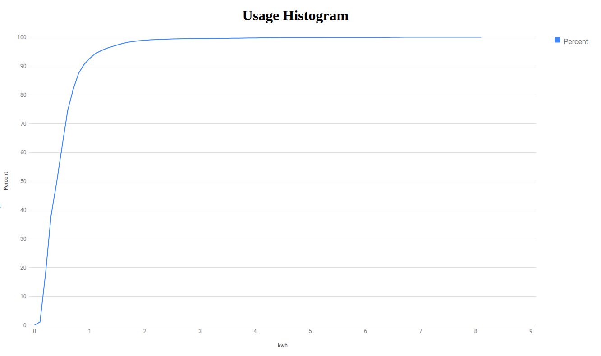

Note: This document is under construction.

# Introduction

This document describes the design and implementation of high voltage, high current DC-AC inverters for residential markets.
In this case, "high voltage" means that the source battery for the inverter has enough voltage and current
that it can power the inverter without a transformer, even at minimum state-of-charge (SoC).
High current means that the inverter design is capable of implementing at least 100-amp and 200-amp inverters,
and possibly even 300-amp or 400-amp inverters.

# Residential Inverter Market

This design is primarily targeted to the North American inverter market, which uses a nominal 120V 60 Hz standard.
Most dwellings have a electrical supply consisting of 3 wires, L1, L2 and neutral.
L1 and L2 are 180 degrees out of phase, and provide 120V service with respect to the neutral wire.
L1 and L2 can be used in tandem to provide a nominal 240V supply for appliances that require more power.
It is common for average-sized dwellings to have 100 amp supply, while newer and larger homes use 200 amp or even 300 amp supplies.

# Inverter Architecture

An inverter is a power converter that converts DC to AC.
The most common architecture for power converters is the classic half-bridge design.
Let's analyze that design and determine if it is suitable for an inverter implementation.

## Overview of Half-Bridge Circuit

Here is a circuit diagram of a classic half-bridge converter.

Using a PWM controller to switch the two MOSFETs, one can generate a voltage between 0 and the input battery
voltage by selecting an appropriate PWM duty cycle.
The controller logic turns Q1 and Q2 on, one at a time, to set the output voltage and current.
Here is the current flow through the circuit when Q1 is switched on.
In this case, the current through the circuit is increasing, limited by the ∂i/∂t of the inductor.

Here is the current flow when Q2 is turned on.
In this case, the current through the circuit is decreasing as a function of the inductor and the load.

When Q2 is on, the converter is basically "coasting" on the inductor.
Designers can control the output ripple current and voltage by selecting appropriate output filter components,
and the frequency at which Q1 and Q2 are switched.

Note, however, that this circuit can only generate DC output.
You can generate a sine wave shaped output offset such that the minimum voltage is greater than zero,
but this circuit will not generate alternating current.

## Modified Half-Bridge Circuit

The first impulse to overcome the half-bridge limitation might be to split the battery into
two equal modules, and set that as the return line.
Essentially, this serves as the neutral wire in a typical residential supply.
Let's analyze that circuit to determine if it will work.

Here is the current flow when Q1 is turned on.

Everything looks good, so far, but that is not the case when Q2 turns on.

There are two problems here:

1. There is no "coast" phase, where the inductor is providing the output current.
2. Switching between Q1 and Q2 causes the circuit to attempt to instantaneously reverse the direction of current flow.
Bad things happen when you do that.

## T-Type Circuit

An established design for inverter circuits is the T-Type architecture, as shown below.
By adding two additional MOSFETs, we provide a controlled path from the output to the battery midpoint,
which solves the problems with the modified half-bridge circuit shown above.

Q1 and Q3 operate as a half-bridge for the positive half of the sine wave, while Q2 and Q4 operate
as a mirrored half-bridge for the negative half of the wave.

Note that Q3 and Q4 can be configured as either common source or common drain.
The configuration will impact the gate driver voltage source design, but the circuit will function either way.

Let's analyze the current flow of this circuit, starting with the positve half of the sine wave,
when the MOSFET switching state is 1001, i.e., Q1 is on, Q2 is off, Q3 is off, and Q4 is on.

Here is the "coast" phase of the positive half of the sine wave, when the MOSFET switching state is 0110.

For the negative have of the sine wave, the current flow reverses.
Here is the current flow for the MOSFET switching state of 0110.

Here is the "coast" phase for the negative half of the sine wave.
Even though the MOSFET switching state is identical to the positive coast phase, the current flow is reversed.

With 4 MOSFETs, there are 16 possible switching configurations, but only 3 are used.

# Battery

The requirement for the battery is that it is able to provide sufficient voltage and current.
Since a 120V RMS voltage source has a peak voltage of 169.7V, the peak-to-peak voltage is 339.4V.
Using the T-Type architecture as explained above, the battery will have 3 lines: positive, middle (0V) and negative.
Generally, this will be provided by a battery with two identical halves, which together have sufficient voltage
headroom to provide adequate power to the inverter at minimum SoC.

The following table describes possible battery configurations for the two most common lithium chemistries.

| Chemistry | Cell Min V | Cell Max V | S Half | S Full | Half Pack Min V | Half Pack Max V | Full Pack Min V | Full Pack Max V |
| --------- | ---------- | ---------- | ------ | ------ | --------------- | --------------- | --------------- | --------------- |
| Li        | 3.0        | 4.2        | 64     |   128  |       192.0     |       268.8     |      384.0      |       537.6     |
| LiFePo    | 3.0        | 3.65       | 72     |   144  |       216.0     |       262.8     |      432.0      |       525.6     |

# DC Link Capacitor

TBD

# MOSFETs

TBD

# Output Filter

TBD

## LCL vs LC Filters

TBD

# Cooling

TBD

# Considerations for Optimization

Residential electrical usage has a lot of transients.
Air conditioners, hot water heaters, ovens, etc. turn on and off.
Many devices like microwaves, toaster ovens, and coffe makers are used for at most a few minutes at a time, at most a few times a day.
Here is an example usage graph from my house in California, showing the usage per minute for one day.
The house has 100 amp electrical panel, with gas water heater, clothes dryer, furnace and stove top.
Everything else is electric.

Aggregating this data for a whole year and plotting a histogram of KW used per minute yeilds the following graph.

If you sum the minutes the inverter would need to run at a given power level, you get the following graph.

This shows that the inverter would run 92.6% of the time at 1 KW or less, and 98.9% of the time at 2 KW or less.
This usage pattern would change with the conversion of the gas appliances to electric, and even more with the purchase of an EV.
Even so, the point remains:  Inverters spend the majority of their time running at very low power levels, and design
optimizations should take this into consideration.
Designers should not focus all their attention on optimizing an inverter at maximum power, while ignoring
optimizations at lower power levels.

# Summary

TBD

