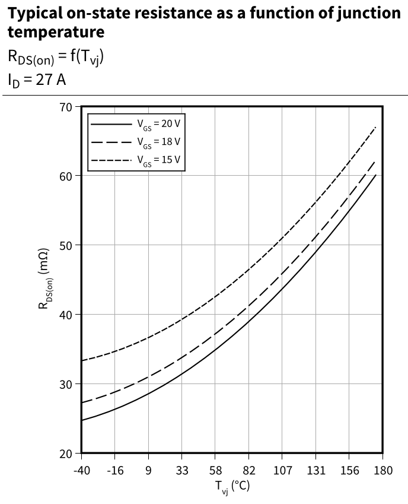
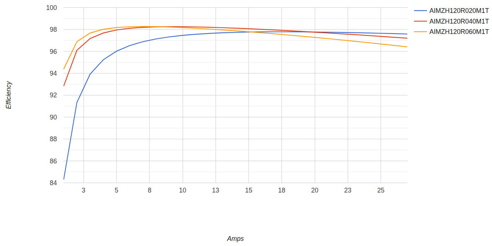

Note: This document is under construction.

# Introduction

This document describes the design and implementation of high voltage, high current DC-AC inverters for residential markets.
In this case, "high voltage" means that the source battery for the inverter has enough voltage and current
that it can power the inverter without a transformer, even at minimum state-of-charge (SoC).
High current means that the inverter design is capable of implementing at least 100-amp and 200-amp inverters,
and possibly even 300-amp or 400-amp inverters.

# North American Residential Inverter Market

This design is primarily targeted to the North American inverter market, which mostly uses a nominal 120V 60 Hz standard.
Most dwellings have a electrical supply consisting of 3 wires, L1, L2 and neutral.
L1 and L2 are 180 degrees out of phase, and provide 120V service with respect to the neutral wire.
L1 and L2 can be used in tandem to provide a nominal 240V supply for appliances that require more power.
It is common for average-sized dwellings to have 100 amp supply, while newer and larger homes use 200 amp or even 300 amp supplies.

The Mexican power grid predominately uses 2 phases of a 220 volt 3-phase source running at 60 Hz.
This yeilds a 127 volt line-to-neutral voltage at 60 Hz, but L1 and L2 are 120 degrees out of phase, so the
voltage difference between them is 220 volts.
Some areas may be compatible with the US 120/240 volt split-phase standard.

# Inverter Architecture

An inverter is a power converter that converts DC to AC.
The most common architecture for power converters is the classic half-bridge design.
Let's analyze that design and determine if it is suitable for a high-voltage battery-powered inverter implementation.

## Overview of Half-Bridge Circuit

Here is a circuit diagram of a classic half-bridge converter.

Using a PWM controller to switch the two MOSFETs, one can generate a voltage between 0 and the input battery
voltage by selecting an appropriate PWM duty cycle.
The controller logic turns on Q1 and Q2, one at a time, to set the output voltage and current.
Here is the current flow through the circuit when Q1 is switched on.
In this case, the current through the circuit is increasing, limited by the ∂i/∂t of the inductor.

Here is the current flow when Q2 is turned on.
In this case, the current through the circuit is decreasing as a function of the inductor and the load.

When Q2 is on, the converter is basically "coasting" on the inductor current.
Designers can control the output ripple current and voltage by selecting appropriate output filter components,
and the frequency at which Q1 and Q2 are switched.

Note, however, that this circuit can only generate DC output.
You can generate a sine wave shaped output offset such that the minimum voltage is greater than zero,
but this circuit will not generate alternating current.

## Modified Half-Bridge Circuit

The first impulse to overcome the half-bridge limitation might be to split the battery into
two equal modules, and set that as the return line.
Essentially, the battery midpoint serves as the neutral wire in a typical residential supply.
Let's analyze that circuit to determine if it will work.

Here is the current flow when Q1 is turned on.

Everything looks good, so far, but that is not the case when Q2 turns on.

There are two problems here:

1. There is no "coast" phase, where the inductor is providing the output current.
2. Switching between Q1 and Q2 causes the circuit to attempt to instantaneously reverse the direction of current flow.
Bad things happen when you do that.

## T-Type Circuit

An established design for inverter circuits is the T-Type architecture, as shown below.
By adding two additional MOSFETs, we provide a controlled path from the output to the battery midpoint,
which solves the problems with the modified half-bridge circuit shown above.

Q1 and Q3 operate as a half-bridge for the positive half of the sine wave, while Q2 and Q4 operate
as a mirrored half-bridge for the negative half of the wave.
Q4 is on while Q1 and Q3 are switching, and Q3 is on while Q2 and Q4 are switching.
Some T-Type diagrams will show the unswitched Q3/Q4 MOSFET as off, with any reverse current going through the body diode.
However, the power loss through the FET will be significantly lower with it on, rather than relying on the body diode.

Note that Q3 and Q4 can be configured as either common source or common drain.
The configuration will impact the gate driver voltage source design, but the circuit will function either way.

Let's analyze the current flow of this circuit, starting with the positve half of the sine wave,
when the MOSFET switching state is 1001, i.e., Q1 is on, Q2 is off, Q3 is off, and Q4 is on.

Here is the "coast" phase of the positive half of the sine wave, when the MOSFET switching state is 0110.

For the negative have of the sine wave, the current flow reverses.
Here is the current flow for the MOSFET switching state of 0110.

Here is the "coast" phase for the negative half of the sine wave.
Even though the MOSFET switching state is identical to the positive coast phase, the current flow is reversed.

With 4 MOSFETs, there are 16 possible switching combinations, but only 3 are used.

# Basic Parameters

TBD

# Battery

The requirement for the battery is that it is able to provide sufficient voltage and current.
Since a 120V RMS voltage source has a peak voltage of 169.7V, the peak-to-peak voltage is 339.4V.
For a 127V voltage system, the peak voltage is 179.6V.
To accommodate unexpected circumstances, it is good practice to plan on tolerating voltages of up to 130V RMS or 183.8V peak.

Using the T-Type architecture as explained above, the battery will have 3 lines: positive, middle (0V) and negative.
Generally, this will be provided by a battery with two identical halves, which together have sufficient voltage
headroom to provide adequate power to the inverter at minimum SoC.

The following table describes possible battery configurations for the two most common lithium chemistries.

| Chemistry | Cell Min V | Cell Max V | S Half | S Full | Half Pack Min V | Half Pack Max V | Full Pack Min V | Full Pack Max V |
| --------- | ---------- | ---------- | ------ | ------ | --------------- | --------------- | --------------- | --------------- |
| Li        | 3.0        | 4.2        | 64     |   128  |       192.0     |       268.8     |      384.0      |       537.6     |
| LiFePo    | 3.0        | 3.65       | 72     |   144  |       216.0     |       262.8     |      432.0      |       525.6     |

# DC Link Capacitor

The DC-link capacitors are located between the battery and the MOSFETs.
Sizing the capacitors is pretty straightforward, using the common formula:

C = I-in_RMS- / (ω-sw- * V-ripple-)

Where I-in_RMS- is the input RMS current, ω-sw- is 2 * π * f-sw- (switching frequency), and
V-ripple- is the maximum tolerable ripple voltage.

For a good capacitor lifetime, select a capacitor with a voltage rating of at least 20% greater than the working voltage.
Film capacitors have good voltage rating and current capacity.

# MOSFETs

The main criteria for selecting MOSFETs are power handling capability, and efficiency, mainly measured by
low on-state resistance (R-ds(on)-) and low switching overhead.

The on-state resistance determines the power loss as current flows through the FET, according to the equation P = I^2^ * R-ds(on)-.
R-ds(on)- is influenced by the junction temperature of the FET and the gate voltage used to switch the FET on.
These influences are shown in the graph from the datasheet for the Infineon AIMZH120R030M1T.

As this graph shows, you get better efficiency running at a cooler temperature and switching with a higher gate voltage.

The switching overhead is determined by the amount of energy is consumed turning the MOSFET on (E-on-) and turning it off (E-off-).
These two values are usually given in microjoules, and added together, give the switching overhead for one complete off/on/off cycle.
Multiply that sum by the switching frequency to get the switching power dissipated for one second.

Like the R-ds(on)- value above, E-on- and E-off- are also a function of the FET junction temperature.
Here is the graph for the same AIMZH120R030M1T MOSFET as above.

As of Fall 2025, the alternatives for FETs are Silicon Carbide (SiC) or Gallium Nitride (GaN).
SiC is preferred, due to their ability to handle high V-ds-, high current, low switching energy and fast switching speed.
Of the available SiC MOSFETs, the author prefers Infineon SiC FETs, due to their higher V-gs(th)- allowing
the use of unipolar gate driver voltage sources, i.e., there is no requirement for a -5V gate driver off voltage.
This simplifies the task of providing gate driver power domains to the inverter.

The following graph shows the estimated efficiency of different FETs in an inverter with the following parameters:

| Parameter    | Value    |
| ---------    | -------- |
| V-out-       | 120 V    |
| I-out-       | 50 A     |
| f-out-       | 60 Hz    |
| f_sw-        | 60 kHz   |
| V-batt-half- | 302.4 V  |
| V-batt-      | 604.8 V  |
| C-dcl-       | 40 uF    |
| L-1-         | 114 uH   |
| C-out-       | 16 uF    |
| L-2-         | 18 uH    |

While the smaller FETs are more efficient, the actual power saved is relatively low.

# Output Filter

TBD

## LCL vs LC Filters

TBD

# Cooling

TBD

# Considerations for Optimization

Residential electrical usage has a lot of transients.
Air conditioners, hot water heaters, ovens, etc. turn on and off.
Many devices like microwaves, toaster ovens, and coffe makers are used for at most a few minutes at a time, at most a few times a day.
Here is an example usage graph from my house in California, showing the usage per minute for one day.
The house has 100 amp electrical panel, with gas water heater, clothes dryer, furnace and stove top.
Everything else is electric.

Aggregating this data for a whole year and plotting a histogram of KW used per minute yeilds the following graph.

If you sum the minutes the inverter would need to run at a given power level, you get the following graph.

This shows that the inverter would run 92.6% of the time at 1 KW or less, and 98.9% of the time at 2 KW or less.
This usage pattern would change with the conversion of the gas appliances to electric, and even more with the purchase of an EV.
Even so, the point remains:  Inverters spend the majority of their time running at very low power levels, and design
optimizations should take this into consideration.
Designers should not focus all their attention on optimizing an inverter at maximum power, while ignoring
optimizations at lower power levels.

# Summary

TBD

